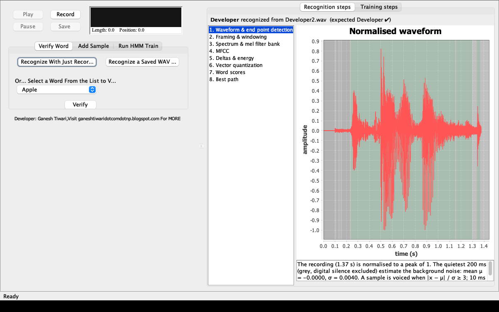
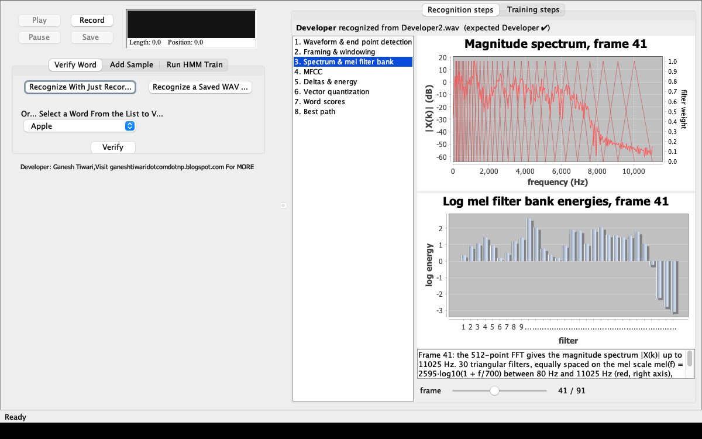
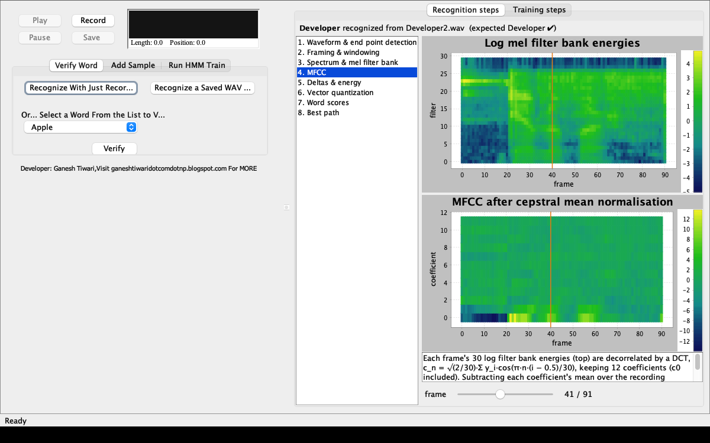
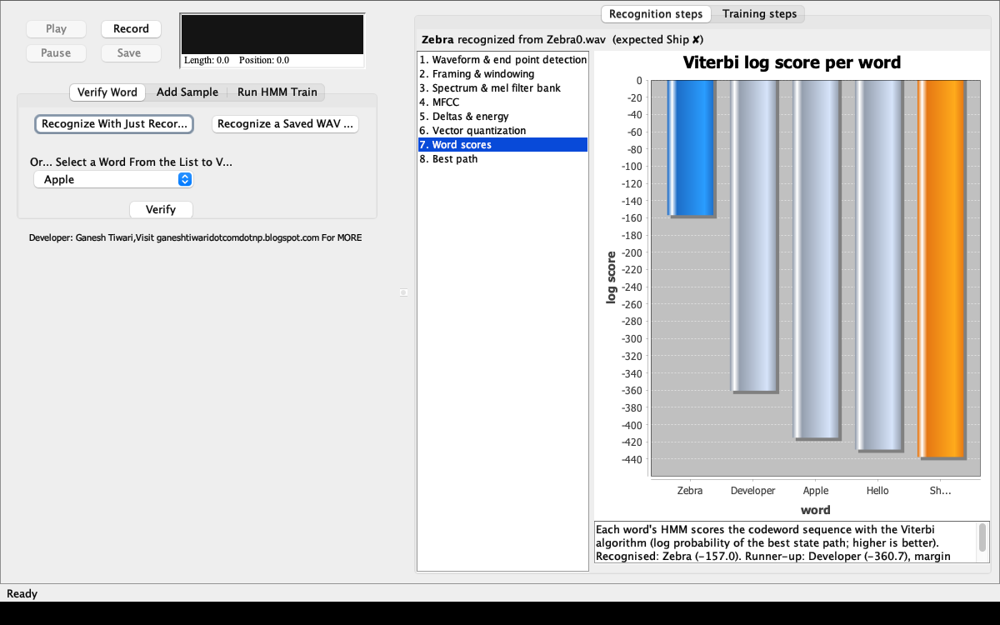
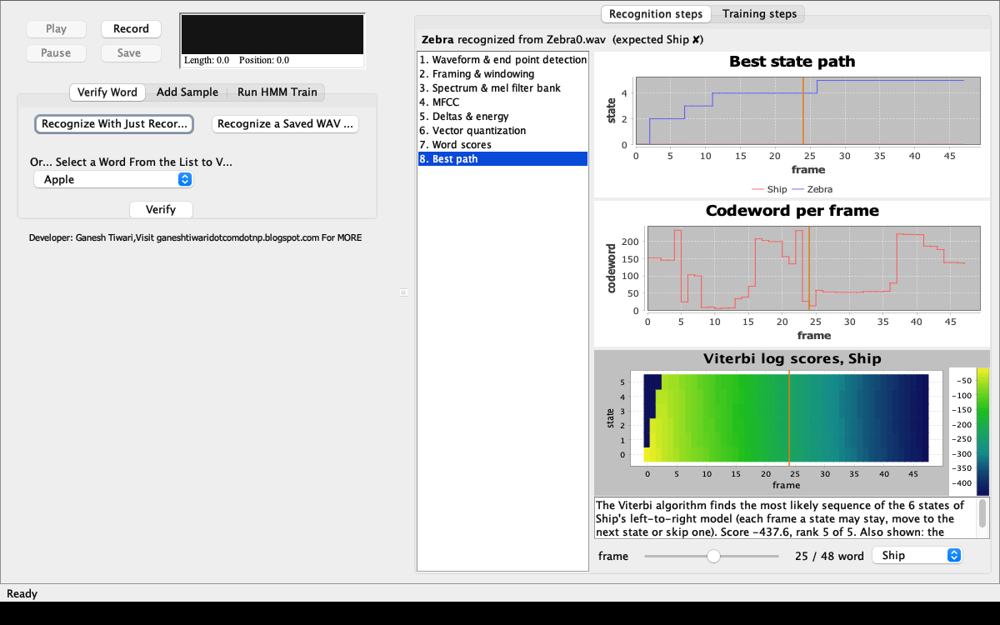
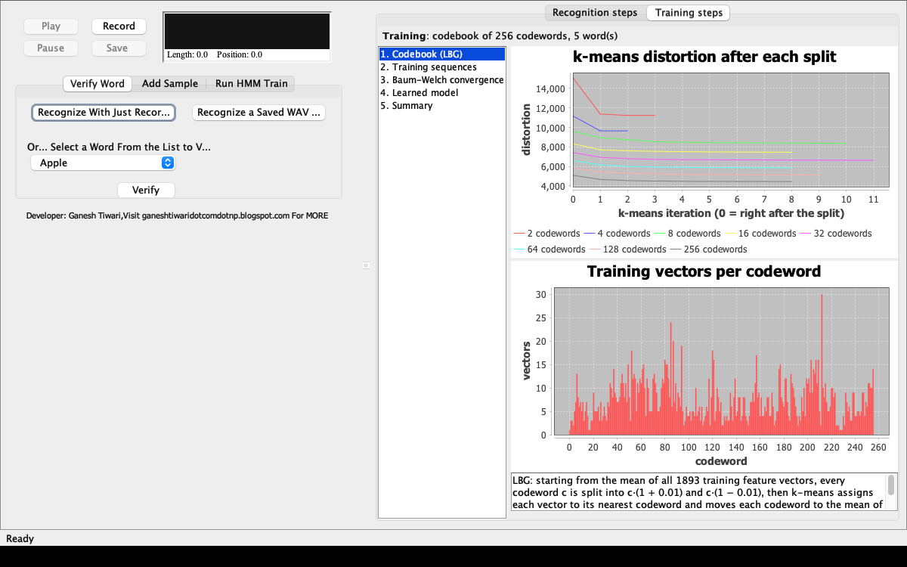
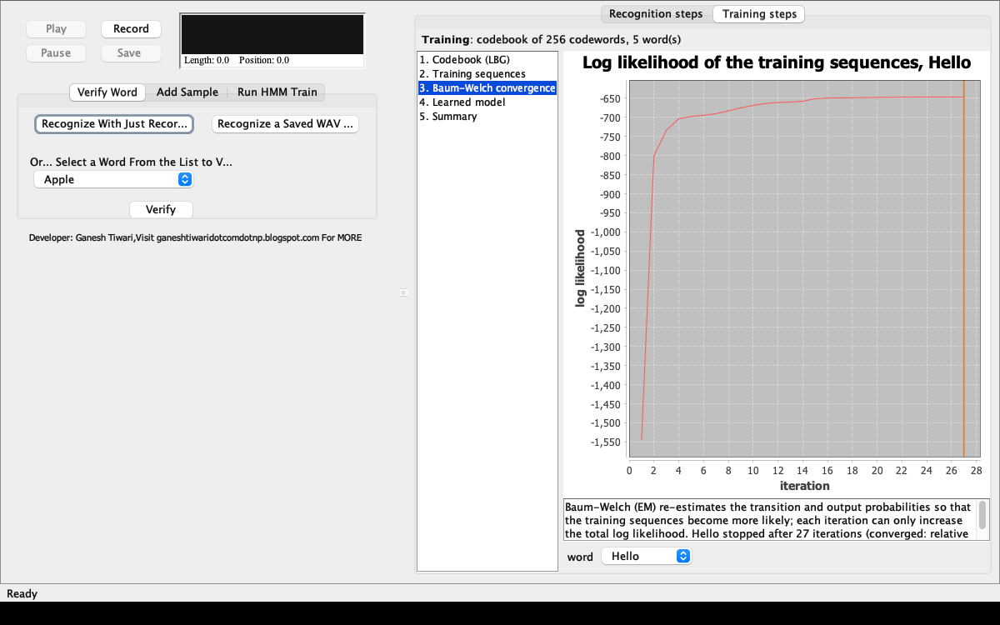
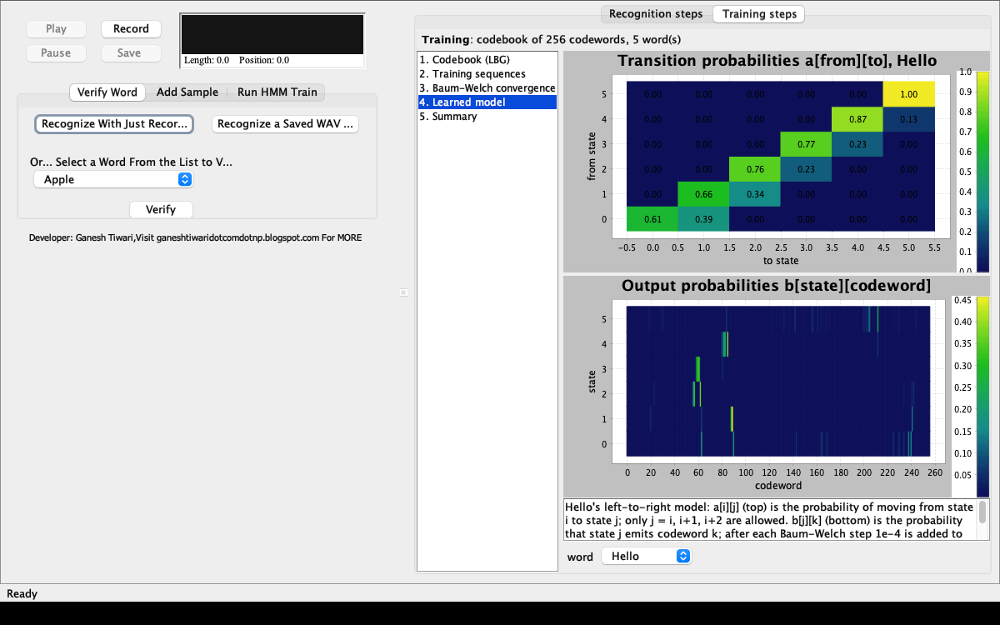

## Java Speech Recognition using Hidden Markov Model / Vector Quantization / MFCC

Isolated word recognition: every recording is turned into a sequence of 39-dimensional MFCC feature
vectors, each vector is replaced by the index of its nearest codeword in a VQ codebook, and the resulting
symbol sequence is scored by one discrete left-to-right HMM per word. The word whose HMM gives the
highest Viterbi score wins.

Automatically exported from code.google.com/p/speech-recognition-java-hidden-markov-model-vq-mfcc

#### Accompanying project report

- http://ganeshtiwaridotcomdotnp.blogspot.com/2011/06/final-report-text-prompted-remote.html

#### Main classes to look into are :

- `org.ioe.tprsa.mediator.Operations` : demonstrates codebook generation, HMM training and recognition
- `org.ioe.tprsa.ui.HMM_VQ_Speech_Recognition` : GUI to record voice samples per word, train, and test with a just recorded sample or a saved .wav file.
  The right half of the window shows every step of the algorithm for the most recent job: *Recognition steps* (waveform and end point
  detection, framing and windowing, spectrum and mel filter bank, MFCC, deltas and energy, vector quantization, the score of every word
  model and the best state path) and *Training steps* (LBG codebook, training sequences, Baum-Welch convergence, learned matrices,
  summary). Charts show exact values on hover, zoom by dragging and can be saved as PNG (right click).

## Screenshots

Every step of the algorithm can be inspected after a recognition, verification or training run. The left side of
the window keeps the original controls; the right side shows the steps of the most recent job.

**Recognition: waveform and end point detection.** The noise statistics come from the quietest 200 ms (grey);
the 10 ms frames kept as speech are green.



**Recognition: spectrum and mel filter bank** for the frame chosen with the slider, and its 30 log filter bank energies.



**Recognition: MFCC.** Log mel energies and mean-normalised MFCCs over time; the orange line is the selected frame.



**Verification that failed: word scores.** A *Zebra* recording verified as *Ship*: every word model's Viterbi
score, the recognised word highlighted (blue), the expected word marked (orange).



**Verification that failed: best path.** The *Ship* model (red) cannot get past its first state on this recording,
while the *Zebra* model (blue) walks through all six; below are the codeword sequence and the Ship model's Viterbi grid.



**Training: LBG codebook.** k-means distortion after each split (2 → 256 codewords) and how many training vectors
each codeword received.



**Training: Baum-Welch convergence** of one word's HMM (the orange line marks where training stopped).



**Training: learned model.** Transition probabilities of the left-to-right model and the output probabilities of
each state over the 256 codewords.



### How the screenshots are made

`test/org/ioe/tprsa/ui/ReadmeScreenshots.java` regenerates them from the real application, so they always show the
current code and models:

1. it computes real traces: recognition of `TrainWav/Developer/Developer2.wav` and a verification of
   `TrainWav/Zebra/Zebra0.wav` as *Ship* with the committed models, and a codebook + HMM training run on a
   temporary copy of `TrainWav/` (so `models/` is not touched);
2. it opens the real main window, hands the traces to its inspectors and selects steps, frames and words on the
   Swing event thread, exactly as a click would;
3. it paints the window's content pane into a `BufferedImage` and writes it as PNG, so no screen capture
   permission or manual cropping is needed.

It needs a display (it is not a unit test). From the project root:

```
mvn -q test-compile
java -cp "target/classes:target/test-classes:$HOME/.m2/repository/org/jfree/jfreechart/1.5.6/jfreechart-1.5.6.jar" \
    org.ioe.tprsa.ui.ReadmeScreenshots docs/screenshots
```

## Algorithm

```
 .wav (22.05 kHz, 16 bit, mono)
   │  PreProcess          normalise ─► end point detection ─► framing ─► pre-emphasis ─► Hamming window
   ▼
 frames of 512 samples
   │  FeatureExtract      MFCC (FFT ─► mel filter bank ─► log ─► DCT) ─► CMN ─► deltas ─► energy
   ▼
 T × 39 feature vectors
   │  Codebook.quantize   nearest of 256 codewords (LBG / k-means trained)
   ▼
 T symbols in 0..255
   │  HiddenMarkov        Viterbi score against each word's 6-state left-to-right HMM
   ▼
 best matching word
```

### 1. Pre-processing (`audio.PreProcess`, `audio.preProcessings.EndPointDetection`)

| Step | What it does |
|---|---|
| Normalisation | divide every sample by the peak absolute amplitude, so the signal lies in [-1, 1] |
| End point detection | the background noise is estimated from the quietest 200 ms of the recording: the 20 lowest-energy 10 ms frames, skipping all-zero frames (the recorder writes ~100 ms of digital silence at the start, and speech can begin right after it, so the paper's "first 200 ms" would mix silence and speech). With the noise mean μ and standard deviation σ a sample is *voiced* when \|x − μ\| / σ ≥ 3 (one-dimensional Mahalanobis distance; 3σ covers 99.7 % of Gaussian noise). The signal is cut into 10 ms frames, a frame is kept when most of its samples are voiced, and the kept frames are concatenated (silence removal). When nothing is voiced, or there is no non-silent frame to estimate the noise from, the signal is kept unchanged. Reference: *A New Silence Removal and Endpoint Detection Algorithm for Speech and Speaker Recognition Applications* (IIT Kharagpur) |
| Framing | frames of N = 512 samples (23.2 ms) with 50 % overlap (hop 256), i.e. 2·L/N − 1 frames; a signal shorter than one frame becomes one zero padded frame |
| Pre-emphasis | per frame, before windowing: s'(n) = s(n) − 0.95·s(n−1), and s'(1) = (1 − 0.95)·s(1) (HTK Book eq. 5.1) |
| Windowing | Hamming window w(n) = 0.54 − 0.46·cos(2π(n−1)/(N−1)), n = 1..N (HTK Book eq. 5.2) |

### 2. Feature extraction (`audio.FeatureExtract`, `audio.feature.*`)

Per (pre-emphasised, windowed) frame:

1. **FFT** (512-point radix-2, `FastFourierTransform`), then the **magnitude spectrum** |X(k)|.
2. **Mel filter bank**: 30 triangular filters with centres equally spaced on the mel scale
   mel(f) = 2595·log10(1 + f/700) (HTK Book eq. 5.13), between 80 Hz and fs/2 = 11025 Hz. Each triangle
   rises from 0 at the previous filter's centre to 1 at its own centre and falls back to 0 at the next centre.
3. **Log** of each filter output, floored at −50.
4. **DCT** (`DCT`, HTK Book eq. 5.14): c_n = √(2/30)·Σ_{i=1..30} y_i·cos(π·n·(i − 0.5)/30), keeping
   n = 0..11, i.e. **12 MFCCs** (c0 included).

Over the whole utterance:

5. **Cepstral mean normalisation**: the mean of each coefficient over all frames is subtracted, which
   removes a constant channel/microphone effect.
6. **Deltas** (`Delta`) by linear regression over ±M frames (HTK Book eq. 5.16):
   d_t = Σ_{m=1..M} m·(c_{t+m} − c_{t−m}) / (2·Σ_{m=1..M} m²).
   M = 2 for ΔMFCC, M = 1 for ΔΔMFCC (the delta of the delta). At the start and end the first / last frame is
   replicated to fill the window (HTK default).
7. **Log energy** (`Energy`, HTK Book eq. 5.15) of each *raw* frame (before pre-emphasis and windowing, HTK
   `RAWENERGY = T`), log Σ x², floored at 1e-10 so silence stays finite, plus its Δ and ΔΔ (M = 1).

Feature vector per frame (39 values):
`[ 12 MFCC | 12 ΔMFCC | 12 ΔΔMFCC | log E | Δ log E | ΔΔ log E ]`

### 3. Vector quantization (`classify.speech.vq.Codebook`)

A 256-entry codebook is trained on the feature vectors of **all** training recordings with the
**LBG (Linde–Buzo–Gray) algorithm**:

1. start with a single codeword: the mean of all training vectors;
2. **split** every codeword c into c·(1 + ε) and c·(1 − ε), with ε = 0.01;
3. **k-means**: assign every vector to its nearest codeword (Euclidean distance), move each codeword to
   the mean of its cell, and repeat until the total distortion improves by less than 0.1 or 0.1 %
   (at most 100 iterations). An empty cell takes the nearest vector from the closest cell that has
   more than one vector;
4. repeat 2–3 until there are 256 codewords.

Quantizing a recording replaces every 39-dimensional vector by the index (0..255) of its nearest
codeword, giving the observation sequence for the HMMs.

### 4. Hidden Markov models (`classify.speech.HiddenMarkov`)

One **discrete HMM per word** with N = 6 states and M = 256 output symbols (one per codeword).

- **Topology**: left-to-right (Bakis) model; from state i only states i, i+1 and i+2 are reachable
  (a_ij = 0 for j < i or j > i + 2), and every sequence starts in the first state (π = [1, 0, …, 0]).
- **Initialisation**: random transition and output probabilities, each row normalised to sum to 1. The
  random generator is seeded with the word's hash code, so retraining on the same data gives the same model.
- **Training**: Baum–Welch (EM) on all recordings of the word, using the *scaled* forward–backward
  algorithm (Rabiner, 1989) to avoid underflow:
  - forward: α̂_t(i) is α_t(i) normalised so Σ_i α̂_t(i) = 1, with scale c_t = 1 / Σ_i α_t(i); then
    log P(O | λ) = −Σ_t log c_t;
  - backward β̂_t(i) scaled with the same c_t;
  - ξ_t(i,j) = α̂_t(i)·a_ij·b_j(O_{t+1})·β̂_{t+1}(j) and γ_t(i) = α̂_t(i)·β̂_t(i) / c_t, summed over all
    recordings;
  - a_ij = Σ ξ_t(i,j) / Σ γ_t(i) over t < T−1, and b_j(v) = Σ_{t: O_t = v} γ_t(j) / Σ_t γ_t(j);
  - every allowed probability is floored at 1e-4 and the rows are renormalised, so a codeword never
    seen in training does not make a word impossible;
  - iterations stop when the total log likelihood changes by less than 1e-5 (relative), or after 50.
- **Recognition**: the **Viterbi** algorithm in the log domain gives the log probability of the best state
  path for each word's HMM (π_i = 0 is log 0 = −∞, so every path starts in the first state); the word with
  the highest score is returned.

### Accuracy

Measured on the bundled `TrainWav/` recordings (5 words, 39 recordings):

| | Accuracy |
|---|---|
| Training recordings, committed models | 39 / 39 |
| Held-out recordings, 3-fold cross validation over 6 random splits | ≈ 96 % (225 / 234) |

Most of the earlier errors came from end point detection cutting away the speech of recordings where the
word starts right after the recorder's leading silence (fixed by estimating the noise from the quietest
200 ms). With about 6 recordings per word, more recordings per word (and per speaker) is now the most
effective way to improve accuracy further.

### Verification against reference sources

| Component | Reference | How it was checked |
|---|---|---|
| HMM forward, Viterbi, Baum–Welch | Rabiner, *A Tutorial on Hidden Markov Models and Selected Applications in Speech Recognition*, Proc. IEEE 77(2), 1989 (eqs. 18–40, 91–110) | a one-iteration Baum–Welch update, log P(O\|λ) and the Viterbi score match an independent unscaled textbook implementation to ~1e-16; unit tests compare forward and Viterbi against brute-force enumeration of all state paths |
| FFT | Smith, *The Scientist and Engineer's Guide to DSP*, ch. 12 | unit test against a direct DFT for N = 2..512 |
| Pre-emphasis, Hamming, mel filter bank, DCT, energy, deltas | Young et al., *The HTK Book*, ch. 5 (eqs. 5.1, 5.2, 5.13–5.16) | each block compared with the HTK formula: exact match |
| Cepstral mean normalisation | *The HTK Book*, sec. 5.6 | unit test: every MFCC has zero mean over the utterance |
| End point detection | Saha, Chakroborty, Senapati, *A New Silence Removal and Endpoint Detection Algorithm for Speech and Speaker Recognition Applications*, NCC 2005 | 200 ms noise estimate, 3σ threshold, 10 ms majority vote as in the paper; deliberate deviation: the noise is taken from the quietest 200 ms instead of the first 200 ms (see Pre-processing), which raised held-out accuracy from ≈ 84 % to ≈ 96 % |
| VQ codebook | Linde, Buzo, Gray, *An Algorithm for Vector Quantizer Design*, IEEE Trans. Commun. 28(1), 1980 | unit tests: k-means fixed point (every codeword is the mean of its cell), cluster separation |

Practical additions that are not in the references: the 1e-4 probability floor, the 1e-10 energy floor and
the −50 log filter bank floor (keep unseen symbols and silent frames finite).

### References

1. L. R. Rabiner, *A Tutorial on Hidden Markov Models and Selected Applications in Speech Recognition*,
   Proceedings of the IEEE, 77(2), pp. 257–286, 1989.
   [PDF](https://www.biostat.wisc.edu/~kbroman/teaching/statgen/2004/refs/rabiner.pdf)
   ([alternate copy](https://cs.brown.edu/courses/csci2840/spring-2021/handouts/A%20tutorial%20on%20hidden%20markov%20models.pdf))
2. *An Erratum for "A Tutorial on Hidden Markov Models and Selected Applications in Speech Recognition"*
   (corrections to the scaling and multiple observation sequence sections).
   [PDF](https://home.engineering.iastate.edu/alexs/classes/2024_Spring_575/HW/HW5/PDFs/errata.pdf)
3. S. Young et al., *The HTK Book*, chapter 5 "Speech Input/Output": pre-emphasis and Hamming window
   (eqs. 5.1, 5.2), mel filter bank (5.13), cepstral coefficients (5.14), energy (5.15), deltas (5.16).
   [PDF](https://ai.stanford.edu/~amaas/data/htkbook.pdf)
4. G. Saha, S. Chakroborty, S. Senapati, *A New Silence Removal and Endpoint Detection Algorithm for Speech
   and Speaker Recognition Applications*, Proc. 11th National Conference on Communications (NCC), IIT Kharagpur,
   pp. 291–295, 2005.
   [ResearchGate](https://www.researchgate.net/publication/253576923_A_New_Silence_Removal_and_Endpoint_Detection_Algorithm_for_Speech_and_Speaker_Recognition_Applications)
5. Y. Linde, A. Buzo, R. M. Gray, *An Algorithm for Vector Quantizer Design*, IEEE Transactions on
   Communications, 28(1), pp. 84–95, 1980.
   [Summary](https://en.wikipedia.org/wiki/Linde%E2%80%93Buzo%E2%80%93Gray_algorithm)
6. S. W. Smith, *The Scientist and Engineer's Guide to Digital Signal Processing*, chapter 12
   "The Fast Fourier Transform". [Online](https://www.dspguide.com/ch12/3.htm)

#### Build, test and run (Maven, JDK 17+)

- `mvn test` : unit tests + an end-to-end recognition test over `TrainWav/` using the committed models
- `mvn package && java -jar target/speech-recognition-hmm-vq-mfcc-1.0-SNAPSHOT.jar` : launch the GUI (run from the project root, model/wav paths are relative)
- Retrain after changing the feature extraction: `Operations.generateCodebook()` then `Operations.hmmTrain()`
  (also available from the GUI). Training is seeded, so the same recordings always give the same models.

##### Folder conventions :

- `TrainWav/<Word>/<Word><n>.wav` : training recordings, one folder per word (22.05 kHz, 16 bit, mono)
- `models/codeBook/codebook.cbk` : VQ codebook
- `models/HMM/<Word>.hmm` : one trained HMM per word

### Please feel free to use/modify the code !

### For any queries :

##### Email : gtiwari333@gmail.com
##### Blog : http://ganeshtiwaridotcomdotnp.blogspot.com/
